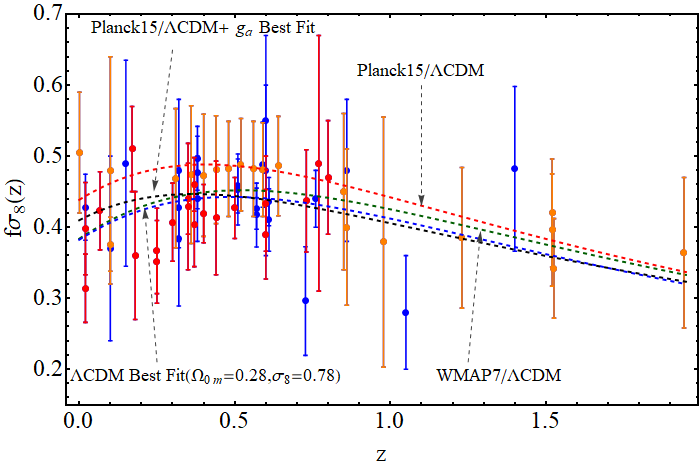

# Evolution of the f&sigma;8 Tension with the Planck15-&Lambda;CDM Determination and Implications for Modified Gravity Theories.

This is the repository that contains the short version of the Mathematica code of the master branch.

